<!-- 🖼️ Animated Banner -->

  

<h1 align="center">Hi 👋, I'm VasanthKumar</h1>
<h3 align="center">💻 Software Developer | 🤖 AI Enthusiast | 🚀 Lifelong Learner</h3>
<h3 align="center"><i>“Turning AI ideas into real-world impact.”</i></h3>

---

### 🔍 About Me  
**“I don't just write code — I build thinking systems.”**

I'm **Vasanth Kumar**, a developer who finds clarity in complexity.  
My work lives at the intersection of **software engineering** and **artificial intelligence**, where I transform abstract ideas into reliable, scalable tools.

- 🧠 I’m fascinated by systems that evolve, adapt, and learn over time — whether digital or human-made.  
- ⚙️ I thrive on crafting backbones of systems — architectures that are fast, resilient, and quietly powerful.  
- 📦 I believe the best solutions are often invisible: intuitive, seamless, and built with intention.  
- 🔭 I'm drawn to ideas that challenge convention and tools that push boundaries.  
- 🛠️ I’m not just building for today — I’m building for how we’ll work, think, and connect tomorrow.  
- 📫 Reach me anytime: [vasanthkumars.dev@gmail.com](mailto:vasanthkumars.dev@gmail.com)

---

### 🚀 Tech Stack

#### 🧠 AI / Machine Learning

  
  
  
  

#### ⚙️ Backend & API Development

  

#### 🧪 Model Deployment & Ops

  
  
  

#### 🧰 Dev Tools & Cloud

  
  
  

---

### 🌐 Let’s Connect

> *Whether it’s AI, backend systems, or cool side projects — I’m always up for a good conversation.*

  
  
  

---

### 📊 GitHub Metrics

#### 🧠 Languages

#### ⏱️ Coding Habits

#### 📦 PRs & Issue Follow-ups

#### 💬 Reactions

#### 🕒 Recent Activity

#### 📆 Yearly Contributions

---

  

---

  Built with 💡 by Vasanth Kumar • Last updated: 2025

